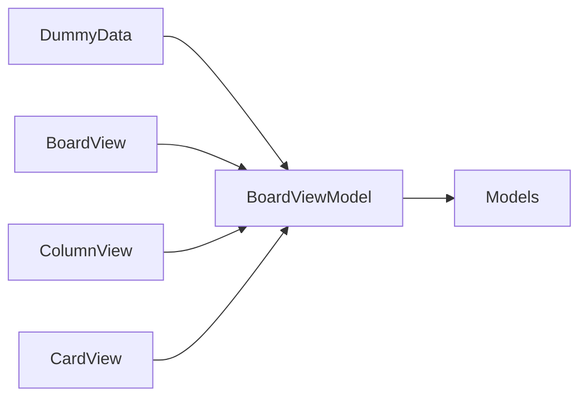

# Kanban MVP Plan

Greenfield repo (only [AGENTS.md](AGENTS.md) today). Build a single-board, client-rendered app under `frontend/`. No persistence, no auth, no extra features.

## Stack

- **Vite + React + TypeScript** (client-rendered Node app, current popular defaults)
- **@dnd-kit** for accessible drag-and-drop
- **Vitest + Testing Library** for unit tests (ViewModel first)
- **Playwright** for browser integration tests
- **Plain CSS** with the specified palette as CSS variables (no extra UI kit)

## Architecture (MVVM, keep it small)

- **Model:** `Card { id, title, details }`, `Column { id, title, cards }`, `Board { columns }` (exactly 5 columns)
- **ViewModel:** one `BoardViewModel` owned by a React context: rename column, add card, delete card, move card (column + index). Views do not mutate board state.
- **View:** `BoardView`, `ColumnView`, `CardView`, plus a small add-card form. Inline rename for column titles. Cards show title + details; add form collects both. Editing existing card fields is in scope (title/details are the card); archive/search/filters are not.
- Dummy board seeded on load (product-ish sample cards across all 5 columns).

Layout: `frontend/src/models`, `frontend/src/viewmodels`, `frontend/src/views`, `frontend/src/data/dummyBoard.ts`.

## UI

Professional, sparse board: dark navy headings, gray labels, yellow accent on column tops / drag highlight, blue for secondary actions (add), purple for primary submit (create card). Light canvas, generous spacing, clear empty-column drop targets.

## Phases and success criteria

### Phase 1: Scaffold
- Root [`.gitignore`](.gitignore): `node_modules`, `dist`, coverage, Playwright artifacts, OS junk
- [README.md](README.md): how to install, `npm run dev`, `npm test`, `npm run test:e2e` (minimal, no emojis)
- `frontend/` Vite React TS app, scripts for unit + e2e
- Success: `cd frontend && npm install && npm run build` succeeds

### Phase 2: ViewModel + unit tests
- Implement model types, dummy data, `BoardViewModel` (in-memory only)
- Vitest covers: dummy board has 5 columns; rename; add/delete card; move within and across columns
- Success: `npm test` green with those cases

### Phase 3: Views + DnD
- Wire views to ViewModel; @dnd-kit between (and within) columns
- Add card UI per column; delete on card; inline column rename
- Success: app renders dummy board; interactions work in the browser

### Phase 4: Playwright
- Specs: load dummy titles; rename column; add card; delete card; drag to another column
- Success: `npm run test:e2e` green

### Phase 5: Polish and handoff
- Visual pass against the color scheme; fix Playwright/unit failures
- Success: MVP complete; **Vite dev server left running** (typically http://localhost:5173)

## Out of scope

Persistence, users, multiple boards, adding/removing columns, archive, search/filter, card metadata beyond title + details.
